# Active Vibration Control for a Wearable Hand Exoskeleton

**Wearable active vibration-control prototype · ESP32 + dual MEMS sensing + DSP + adaptive FxLMS · ~57 % controlled-axis narrowband attenuation in final frozen-controller validation**

Master's Thesis, TU Bergakademie Freiberg, Chair of Automated and Autonomous Systems (2026) · **Krishna Kumar Ramamurthi**

[📄 Thesis](docs/thesis/Krishna_Kumar_Ramamurthi_Master_Thesis_Public.pdf) · [⚙️ Final firmware](firmware/05_fxlms_final/) · [📊 Experimental data](data/) · [📈 Results](#experimental-results)

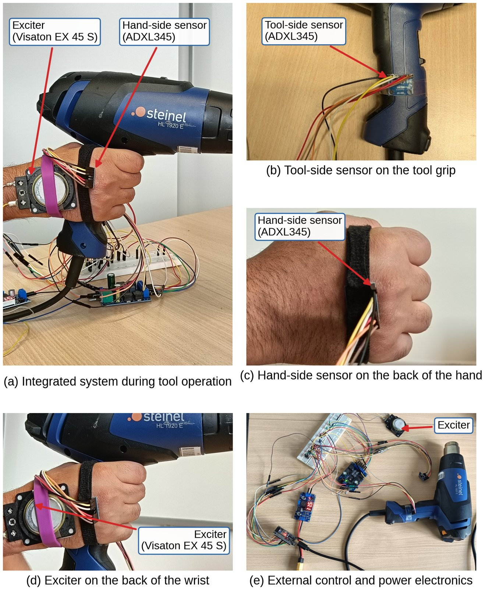
*Final experimental prototype: (a) integrated system during tool operation, (b) tool-side sensor, (c) hand-side sensor, (d) wrist-mounted exciter, (e) control and power electronics.*

## Project at a glance

| | |
|---|---|
| **Problem** | Hand-held power tools transmit vibration into the operator's hand and arm. |
| **What was built** | A wearable active system that measures the tool vibration and generates a counter-vibration at the back of the hand. |
| **Engineering** | VDI 2221 product development, mechanical integration, dual MEMS sensing, ESP32 firmware, DSP, adaptive FxLMS control |
| **Result** | ~57 % reduction of the dominant narrowband vibration component in the controlled axis (frozen-controller validation, X-axis) |
| **Evidence** | Source code, raw and evaluated datasets, thesis, prototype photos, result plots |

## Engineering highlights

1. **System development:** requirements, function structure, morphological analysis and weighted concept evaluation following VDI 2221
2. **Mechanical integration:** wearable mounting of the exciter on the back of the wrist, sensor placement on tool grip and hand
3. **Embedded real-time control:** ESP32 (C++), two ADXL345 sensors over shared SPI at 1600 Hz, DAC-driven actuator chain
4. **Signal processing:** FFT frequency identification and exact-frequency I/Q (quadrature) amplitude and phase estimation
5. **Adaptive control:** automated in-situ secondary-path identification prior to adaptive control, then complex normalized FxLMS with a STARTUP / LEARN / FINE / HOLD state machine
6. **Experimental validation:** staged test campaigns, frozen-weight validation on new data, 60 s persistence tests, OFF–ON–OFF–ON controller validation
7. **Safety:** DAC ceiling, saturation handling, growth guards and emergency stop implemented in firmware

## My contribution

This was my individual Master's thesis. I carried out:

- requirements definition and VDI 2221 concept development and evaluation
- component selection and integration of sensors, amplifier and exciter into the wearable prototype
- ESP32 firmware development for all stages (sensor validation, FFT and quadrature analysis, amplitude matching, phase sweep, secondary-path identification, FxLMS)
- experimental planning, execution and statistical evaluation of all test campaigns
- technical documentation (thesis)

## Demonstrated performance

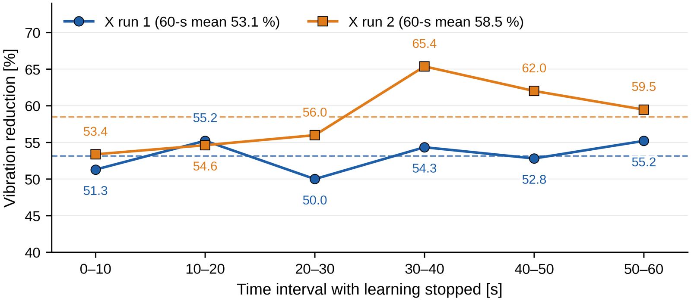
*Frozen-controller persistence test: after learning was stopped, the reduction persisted for 60 s (mean 53.1 % and 58.5 % in two X-axis runs).*

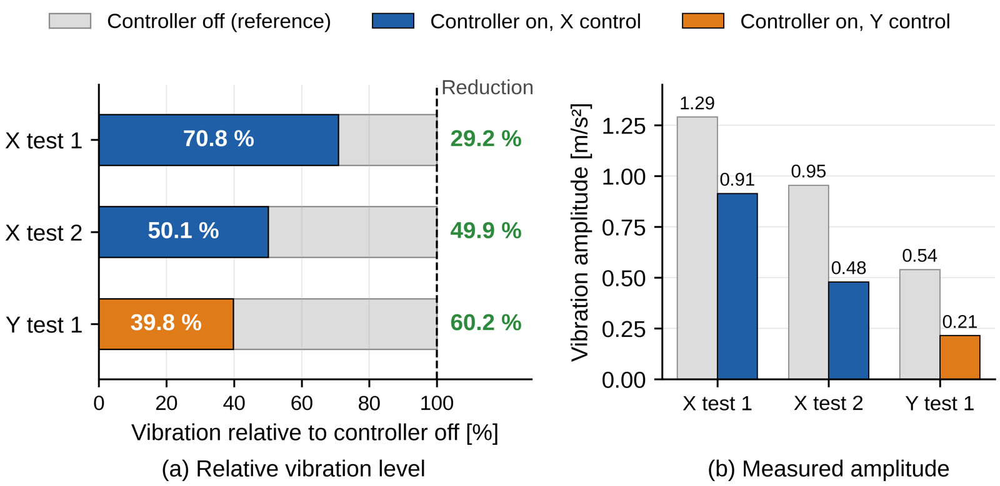
*Controller OFF/ON comparison. Repeated attenuation when control was activated and recovery when it was disabled strengthens the evidence that the reduction was produced by the active controller.*

## System overview

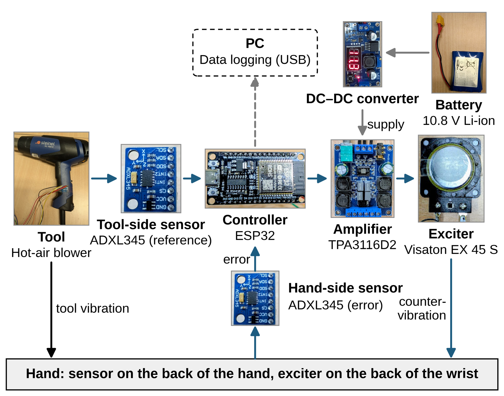

| Item | Configuration |
|---|---|
| Microcontroller | ESP32 (Arduino framework) |
| Sensors | 2 × ADXL345, shared SPI (SCK 18, MISO 19, MOSI 23); CS GPIO5 = tool/reference, CS GPIO17 = hand/error |
| Sensor settings | ±16 g full resolution, 1600 Hz output data rate, SPI mode 3, 5 MHz |
| Actuator chain | ESP32 DAC (GPIO25) → TPA3116D2 Class-D amplifier → Visaton EX 45 S exciter |
| Disturbance source | Hand-held hot-air tool (Steinel HL 1920 E) |

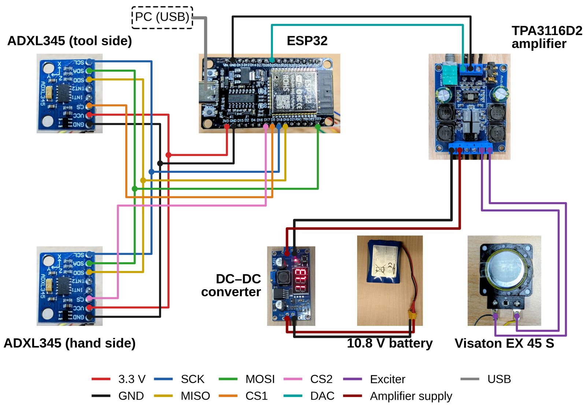

## Mechanical and system design

The concept was developed systematically according to VDI 2221: requirements list, black-box and function-structure models, morphological box and VDI 2225 weighted evaluation of five concept variants.

| | |
|---|---|
| 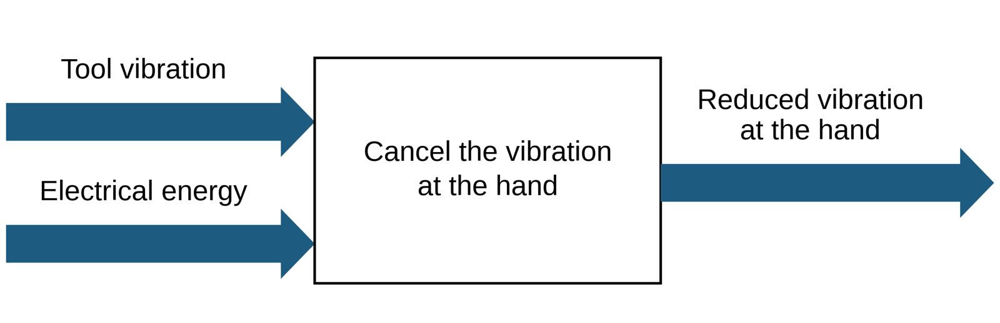 Black-box model | 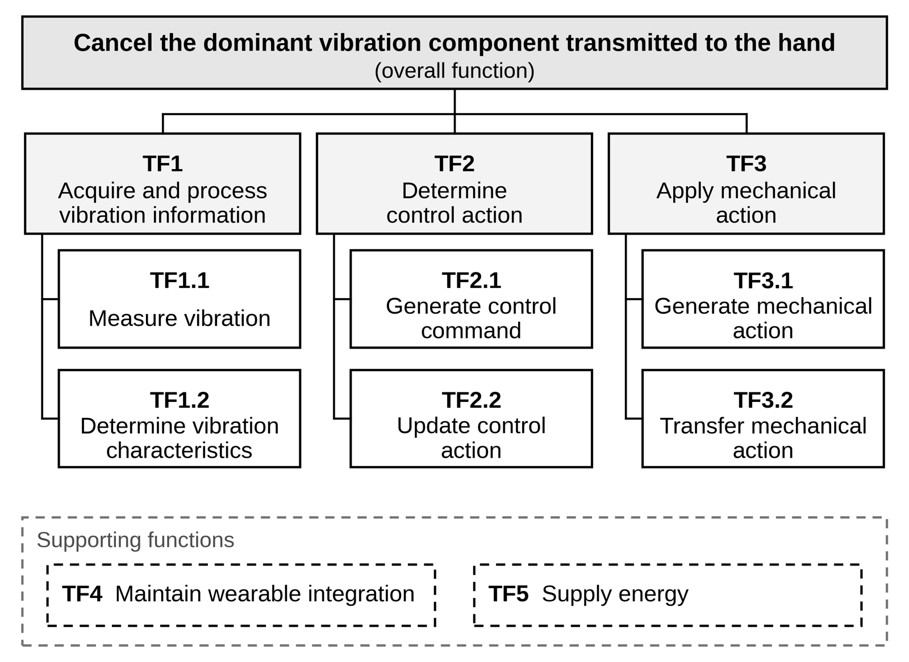 Function structure |

The selected concept places the electrodynamic exciter on the back of the wrist, the error sensor on the back of the hand, and the reference sensor on the tool grip. The prototype is a bench-tethered experimental setup; electronics are on a breadboard and worn parts are attached with straps.

## Signal processing and control

The control strategy was developed in deliberate stages. Each stage was validated before the next was built:

1. **Sensor validation:** static gravity test (sign, scale, bias, repeatability) and stationary noise floor with DATA_READY-synchronized acquisition
2. **Frequency identification:** FFT (N = 1024, Hamming window) locates the dominant tool frequency f0
3. **Exact-frequency quadrature:** I/Q estimation of amplitude and phase at f0
4. **Amplitude matching:** iterative closed-loop matcher (sign-bracketed root finding, secant/bisection refinement, PI servo with trial/revert logic)
5. **Phase cancellation:** coarse/fine phase sweep (30° / 10°); this exposed the limitation of open-loop phase setting under a changing mechanical path
6. **Secondary-path identification + FxLMS:** tool ON → baseline; tool OFF → automated identification of the actuator-to-error-sensor path; tool ON → complex normalized FxLMS adaptation, Wbest retention and independent frozen validation

| | |
|---|---|
| 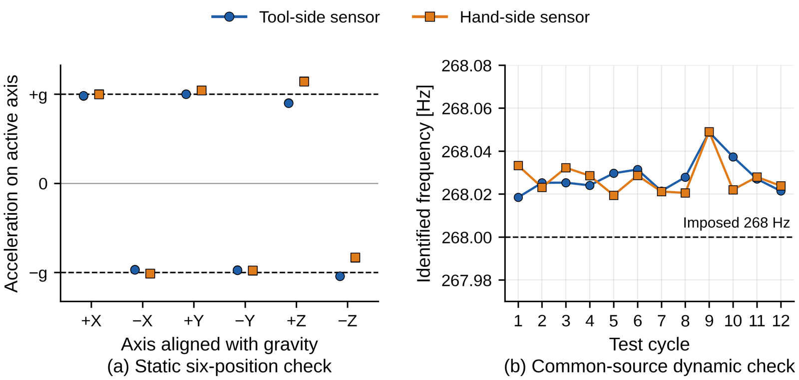 Measurement verification | 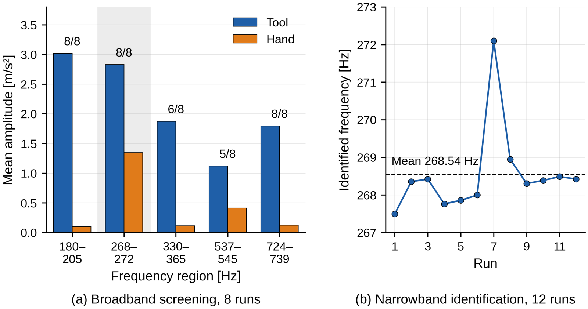 Frequency identification |
| 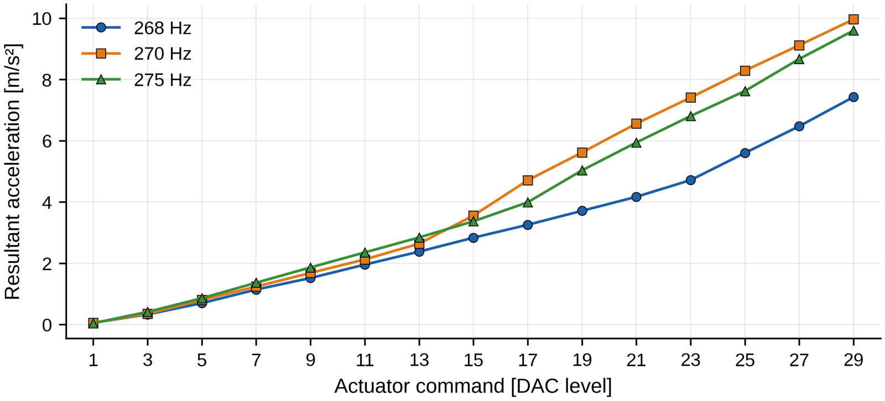 Actuator response | 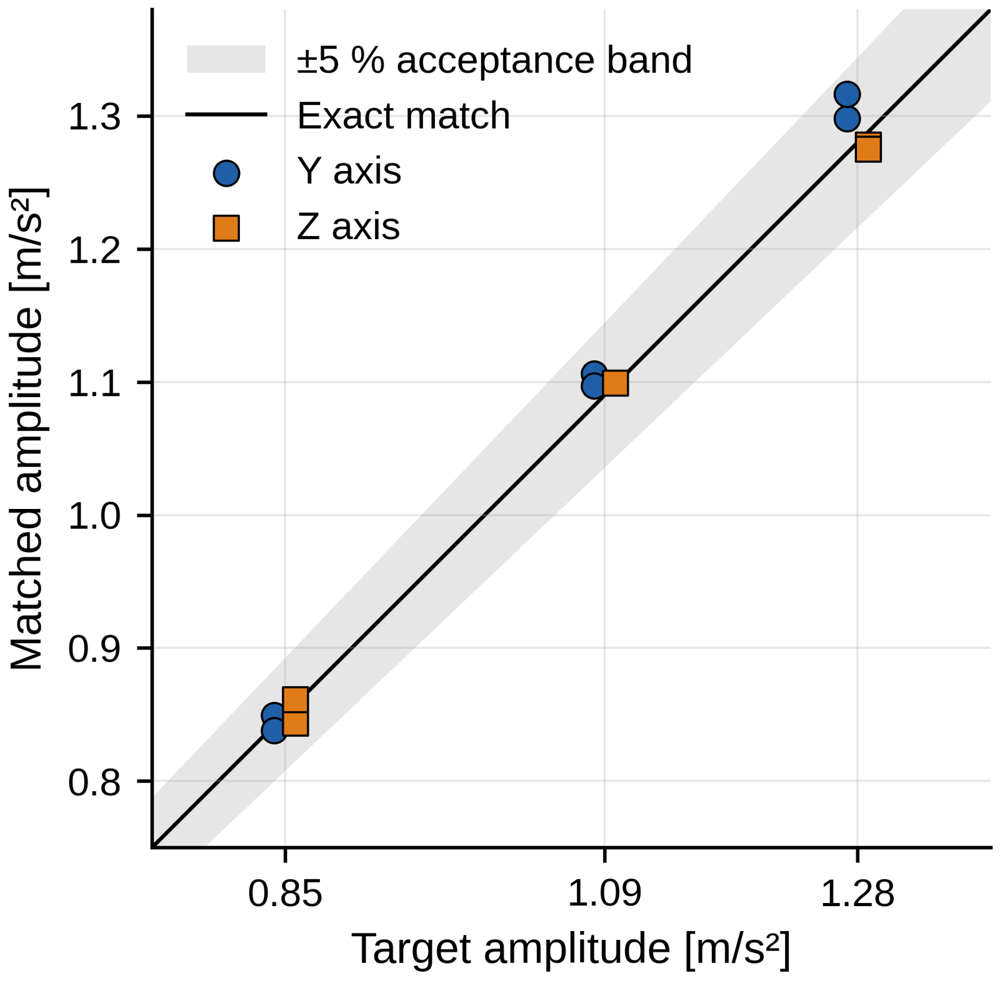 Amplitude matching |
| 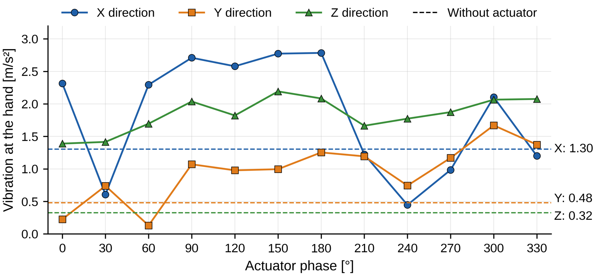 Phase sweep | 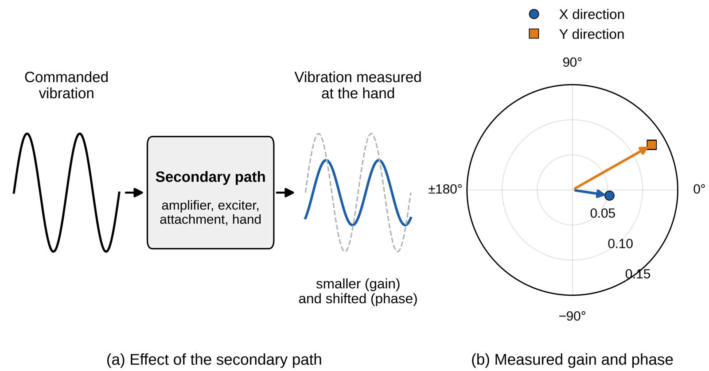 Secondary-path identification |
| 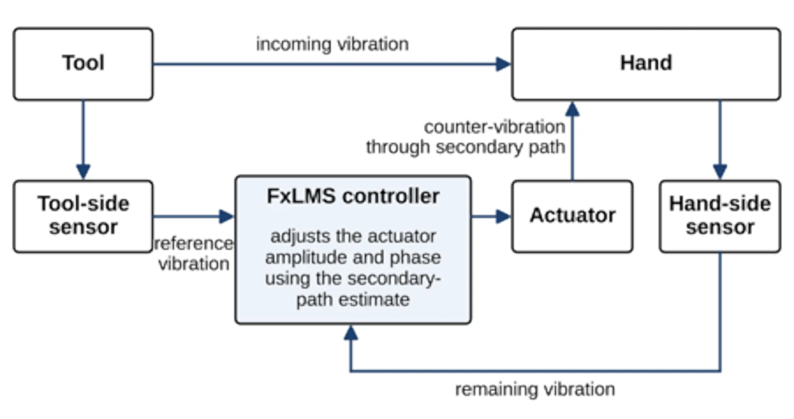 FxLMS structure | 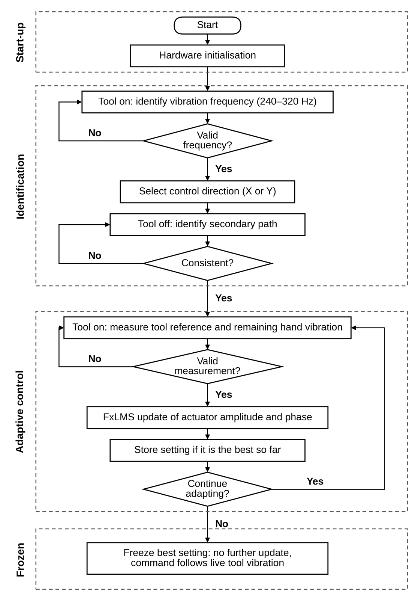 Control flowchart |

## Experimental results

| Test | Result |
|---|---|
| X-axis, FxLMS V1.4R, frozen-weight validation | 57.15 ± 5.26 % reduction (2 runs) |
| X-axis, 60 s persistence stage | 53.15 % and 58.47 % sustained |
| X-axis, FxLMS V1.4, frozen-weight validation | 33.49 ± 13.45 % (5 runs) |
| Y-axis, FxLMS V1.4 | 55.13 ± 3.74 % (5 retained runs) |

| | |
|---|---|
| 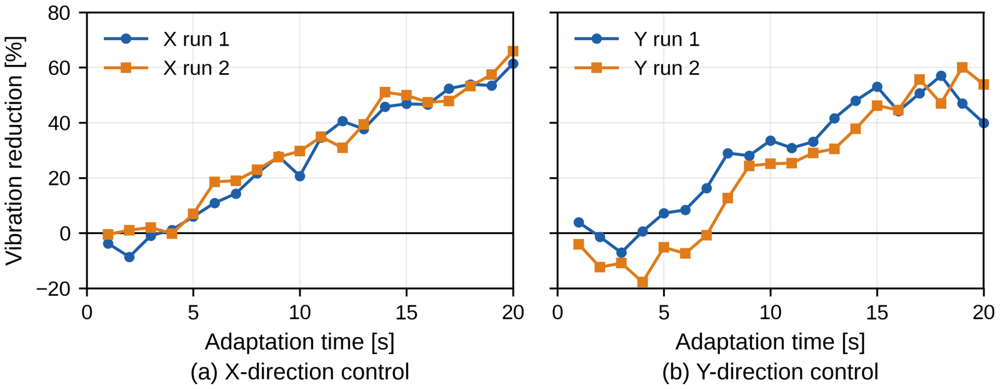 Adaptive learning | 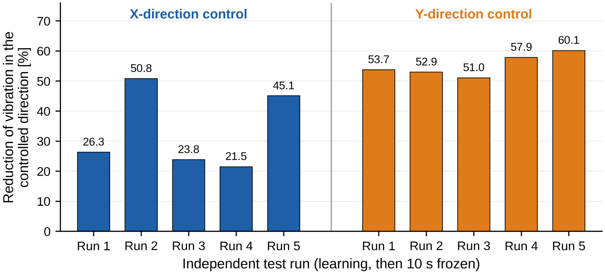 Repeatability |
| 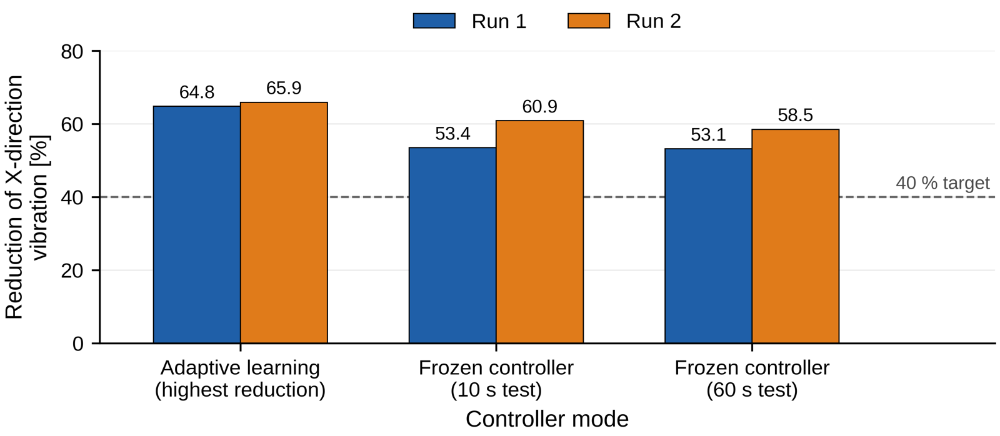 Learning vs. stopped | 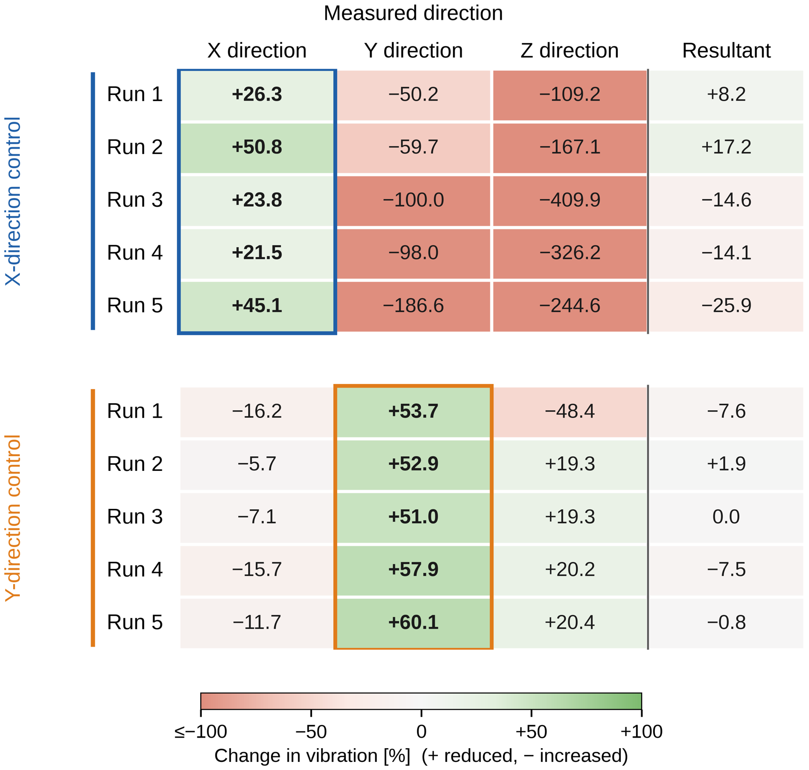 Cross-axis behaviour (frozen weight) |

Statistics, run selection and exclusion criteria are documented in the thesis. A dataset guide is in [data/README.md](data/README.md).

## Scope and limitations

- Bench-tethered experimental proof of concept, not a product
- Results describe reduction of a **narrowband component at the hand-side sensor in the controlled axis**. They are not an ISO 5349 A(8) exposure reduction, and the system is not certified PPE or a validated human-vibration measurement instrument.
- A single exciter cannot cancel orthogonal vibration components; reduction in the controlled axis can redistribute energy into other axes.
- Secondary-path identification is posture-specific; hand movement after identification degrades performance.

## Repository structure

```
firmware/
  01_sensor_validation/    static gravity test, noise-floor test
  02_signal_analysis/      dual-ADXL FFT + quadrature analyzer
  03_amplitude_matching/   integrated FFT/quadrature + amplitude matcher (V5.1R)
  04_phase_cancellation/   phase-sweep firmware (single- and dual-sensor)
  05_fxlms_final/          final FxLMS controller V1.4R (+ CX2 guard variant)
data/                      experimental datasets (Excel) with guide
docs/thesis/               thesis (public version)
docs/images/               prototype photo, diagrams and result figures
```

| Firmware | Stage | Description |
|---|---|---|
| `test01_static_gravity_validation` | 1 | Six-orientation static gravity check of both sensors |
| `test02_noise_floor_data_ready` | 1 | Stationary noise floor, DATA_READY-synchronized sampling |
| `dual_adxl_fft_quadrature_analyzer` | 2–3 | FFT frequency discovery + exact-frequency quadrature |
| `fft_quadrature_amplitude_matcher_v5_1r` | 4 | Integrated analyzer + closed-loop amplitude matcher |
| `single_adxl_phase_sweep_v11_2` | 5 | Phase sweep with recovery and safe fallback |
| `dual_adxl_phase_sweep_v8_1` | 5 | Phase sweep with tool reference sensor |
| `fxlms_v1_4r_auto60` | 6 | **Final controller:** FxLMS with automatic 60 s persistence test |
| `fxlms_v1_4r_auto60_cx2` | 6 | Experimental variant with relaxed cross-axis guard |

## Reproducing the firmware

1. Install the Arduino IDE with the ESP32 board package and the `arduinoFFT` library.
2. Open the sketch folder of the stage you want and flash it to the ESP32.
3. Open the serial monitor at **115200 baud** (newline). Each sketch prints its commands on start-up or with `?`; the full workflow is in each sketch's header comment.

## Safety

The firmware contains amplitude ceilings, growth guards and emergency-stop commands. Never run the actuator on a hand without these guards active.

## Thesis and citation

Ramamurthi, K. K. (2026). *Design and development of a vibration-damping hand-arm-exoskeleton*. Master's thesis, TU Bergakademie Freiberg. [PDF](docs/thesis/Krishna_Kumar_Ramamurthi_Master_Thesis_Public.pdf)

GitHub's "Cite this repository" button (right sidebar) uses `CITATION.cff`.

## License

- **Software** (`firmware/`): MIT License, see [LICENSE](LICENSE)
- **Thesis and documentation:** © Krishna Kumar Ramamurthi, provided for reference
- **Experimental datasets:** provided for academic and reference use; please cite the thesis
